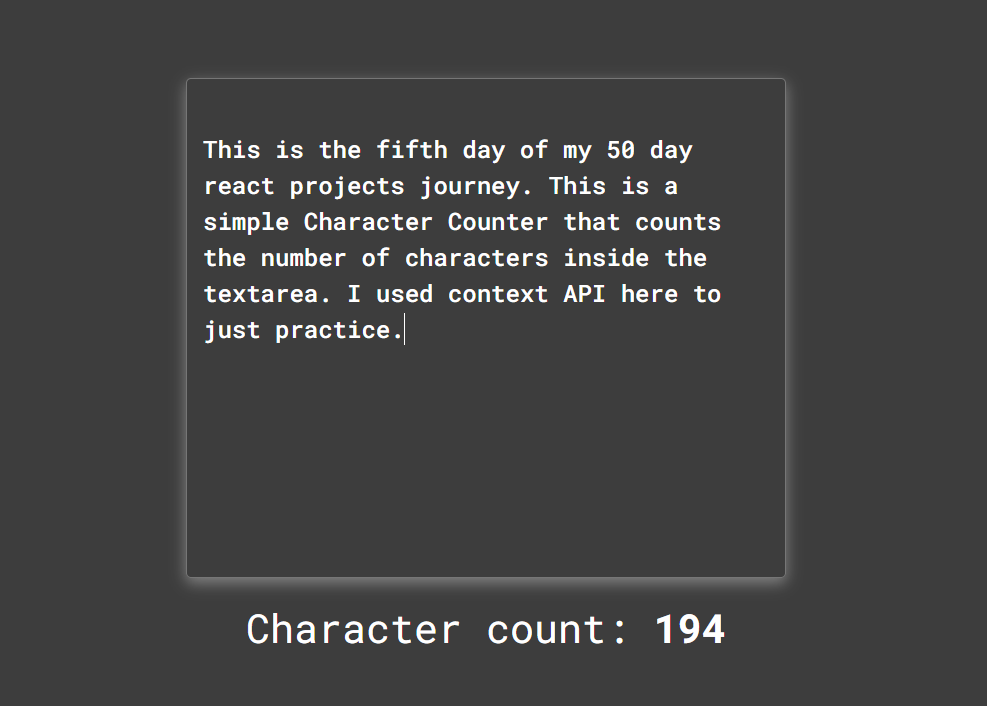

##DAY 7 - Character Counter

This is the fifth day of my 50 day react projects journey. This is a simple Character Counter that counts the number of characters inside the textarea. I used context API here to just practice.

